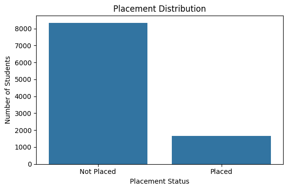

# 
 College Student Placement Analysis 

# 1. Introduction

This project explores a dataset containing academic, personal, and placement details of students from a business school. The objective is to understand what factors influence a student’s likelihood of being placed and to prepare the dataset for predictive modeling using machine learning techniques.

# 2. Dataset Overview

- Dataset Name: college_student_placement_dataset.csv
- Source: https://www.kaggle.com/datasets/sahilislam007/college-student-placement-factors-dataset 
- Rows: 10000
- Columns: 10

    ## 2.1. Dataset Description

    This dataset simulates the academic and professional profiles of 10,000 college students, focusing on factors that influence placement outcomes. It includes features like IQ, academic performance, CGPA, internships, communication skills, and more.

    The dataset is ideal for:
    - Predictive modeling of placement outcomes
    - Educational exercises in classification
    - Feature importance analysis
    - End-to-end machine learning projects

    ## 2.2. Columns Description

    | Column Name | Description |
    | :------- | :------- |
    | College_ID | Unique ID of the college (e.g., CLG0001 to CLG0100) |
    | IQ	Student’s | IQ score (normally distributed around 100) |
    | Prev_Sem_Result | GPA from the previous semester (range: 5.0 to 10.0) |
    | CGPA | Cumulative Grade Point Average (range: ~5.0 to 10.0) |
    | Academic_Performance | Annual academic rating (scale: 1 to 10) |
    | Internship_Experience | Whether the student has completed any internship (Yes/No) |
    | Extra_Curricular_Score | Involvement in extracurriculars (score from 0 to 10) |
    | Communication_Skills | Soft skill rating (scale: 1 to 10) |
    | Projects_Completed | Number of academic/technical projects completed (0 to 5) |
    | Placement | Final placement result (Yes = Placed, No = Not Placed) |

# 3. Data Cleaning

- Null Values: No null values found.
- Duplicate Values: No duplicate values found.
- Dropped ‘College_ID’: As it has no predictive power.
- Encoded ‘InternshiP_Experience’ and ‘Placement’ ‘Yes/No’ to binary (‘1/0’).

# 4. Exploratory Data Analysis (EDA)

- Placement Status:
    
    - A majority of students are not placed (about 83%).
- CGPA’s impact on placement:
    
    - Students with higher CGPA are more likely to be placed.
- Student’s IQ impact on placement:
    
    - Similar trend: higher IQ may correspond with higher placement chances.
- Internship experience impact on placement:
    
    - Students with internship experience (Yes) are more frequently placed.
- Heatmap of Feature Correlation:
    

# 5. Key Insights

- Higher CGPA and IQ scores positively correlate with placement.
- Internship Experience greatly improves placement chances.
- Academic Performance, Communication Skills, and Projects also play a role.
- The target variable 'Placement' is imbalanced (majority not placed).

# 6. Machine Learning Model Suggestion

Based on EDA, Random Forest Classifier on 'Placement' will be the best suited. Random Forest Classifier is suitable due to:

- Ability to handle both numeric and categorical features.
- Handles imbalanced classes well.
- Provides feature importance.

# References

- Dataset: https://www.kaggle.com/datasets/sahilislam007/college-student-placement-factors-dataset
- Tools: Python (Pandas, Matplotlib, Seaborn)
